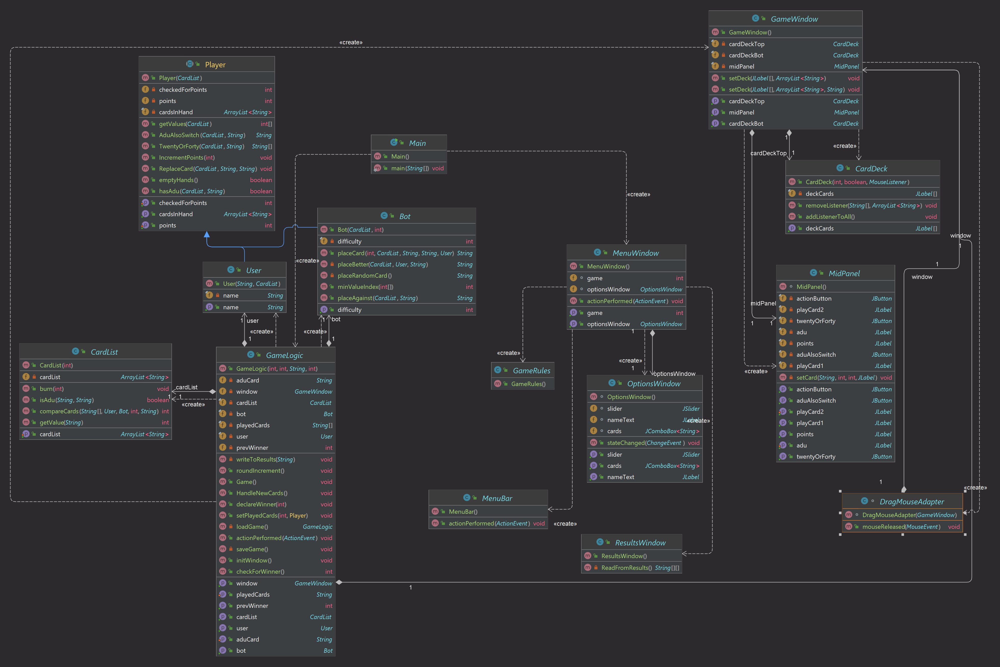

# BMEVIIIAB00 Programozás alapjai 3. házi feladat
A Snapszer egy igen népszerű magyar kártyajáték, amelyet két játékos játszik egymás ellen. A lényege, hogy 66 pontot gyűjtsenek össze minél hamarabb, és ezt be is jelentsék. Mindkét játékos rendelkezik 5-5 kártyával, minden kártyának van egy állandó értéke. Minden körben mindkét játékos lerak egy-egy kártyát, és a nagyobb értékű kártyával rendelkező játékos pontszámához hozzáadja a két letett kártya értékét. Fontos megjegyezni, hogy a játék részleteiről a leírás csak nagy vonalakban szól, részletesebb információkért érdemes ellátogatni a [linkre](http://www.gyerekjatekokrol.hu/jatekok/snapszer/).

## Felépítése

A játékban a meghatározott kártyajátékot lehet egy bot ellen játszani. A bot egy kezdetleges, nem túl okos, egyszerű logika alapján tesz kártyákat, és válaszol kártyákkal a felhasználó által letett kártyákra. A játék SWING GUI támogatással valósul meg, a Collection keretrendszer segítségével.

A játékban láthatjuk a nálunk lévő kártyákat, amik .jpg kiterjesztéssel érhetőek el a projekt könyvtárában, és ezekre kattintva léphetünk velük interakcióba. Ezen kívül, ha elfogynak a kártyák, vagy a felhasználó vagy a bot eléri a 66 pontot, akkor véget ér a játék és kikerül a győztes. A játék egy egyszerű menüvel nyílik meg, ahol választhatunk a játék folytatása vagy új játék kezdése között, utóbbi esetben pedig a játék új ablakban zajlik.

## Osztályok

